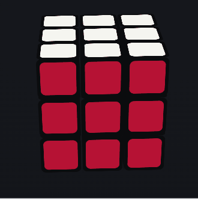

# RubikLoadingSpinner

A tiny, dependency-free loading spinner shaped like a Rubik's Cube. It scrambles with real 3D layer turns, then solves itself, and loops — a small moment of delight while your app waits.

Drop in one file, add one tag. ~8&nbsp;KB, no build step, no dependencies.

<!-- Replace with a real screen capture of index.html (a short GIF works best) -->
<!--  -->

## Demo

Open **[index.html](index.html)** locally, or enable GitHub Pages on this repo to get a live URL.

## Install

Copy `rubiks-spinner.min.js` into your project (5&nbsp;KB, ~2&nbsp;KB gzipped). That's the whole library. The unminified `rubiks-spinner.js` is the readable source with full inline docs.

## Usage

```html
<script src="rubiks-spinner.min.js"></script>
<rubiks-spinner size="120"></rubiks-spinner>
```

Show it while something is loading, then remove it when you're done:

```js
const sp = document.createElement('rubiks-spinner');
document.body.appendChild(sp);
await fetch('/api/things');
sp.remove();            // stops the animation automatically
```

It's a custom element rendered in its own Shadow DOM, so it won't clash with your page's CSS.

## Attributes

| Attribute  | Default | Description |
|------------|---------|-------------|
| `size`     | `48`    | Square size in px. |
| `speed`    | `300`   | Duration of a single 90° turn, in ms (smaller = faster). |
| `gap`      | `60`    | Pause between moves, in ms. |
| `moves`    | `10`    | Number of scramble moves per cycle. |
| `no-orbit` | —       | Stop the idle rotation and lock to a straight-on front view. |
| `logo`     | —       | Image URL (or data URI) shown split across the 9 stickers of the front face. Square images recommended. |

Example:

```html
<rubiks-spinner size="160" speed="220" moves="12" no-orbit></rubiks-spinner>
```

## Front-face logo

Pass any square image to `logo` and it gets sliced across the 3×3 front face, so it assembles when solved and breaks apart while scrambling. When a logo is set, the top face swaps to green automatically so you don't end up with two white faces.

An emoji or letter works well as a data URI:

```js
const logo = "data:image/svg+xml;utf8," + encodeURIComponent(
  `<svg xmlns='http://www.w3.org/2000/svg' viewBox='0 0 100 100'>` +
  `<rect width='100' height='100' fill='#f5f5f0'/>` +
  `<text x='50' y='54' font-size='72' text-anchor='middle' ` +
  `dominant-baseline='central'>😃</text></svg>`);
spinner.setAttribute('logo', logo);
```

Emoji are drawn with the OS emoji font, so the exact look varies by platform (Apple Color Emoji on macOS/iOS, Segoe UI Emoji on Windows). For a consistent look everywhere, point `logo` at an emoji SVG file (e.g. Twemoji).

## Playground

`index.html` is a self-contained tuner: sliders for size, speed, gap and move count, an idle-rotation toggle, a logo builder (text/emoji or pasted SVG with preset + hex colors), and a one-click **Copy code** button that emits an embed snippet with your current settings.

## Notes

- The "solve" is a reverse playback of the scramble, not a real solver — exactly what a spinner needs.
- In the front-view (`no-orbit`) mode, moves that would be fully hidden behind the front face are skipped, so there are no dead pauses.
- `prefers-reduced-motion` is respected: idle rotation stops and turns speed up.

## Files

```
rubiks-spinner.min.js   # use this — minified, no deps
rubiks-spinner.js       # readable source with inline docs
index.html              # demo + playground (also the Pages demo)
```

## License

MIT

---

<sub>ルービックキューブ型のローディングスピナー。1ファイル・依存なし。`index.html` がデモ兼プレイグラウンドです。</sub>
